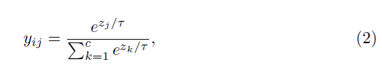
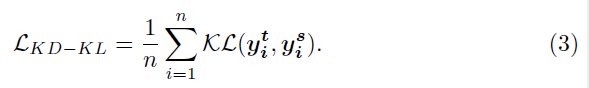
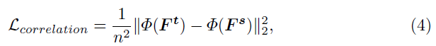
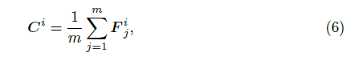
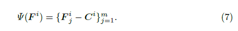
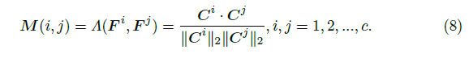
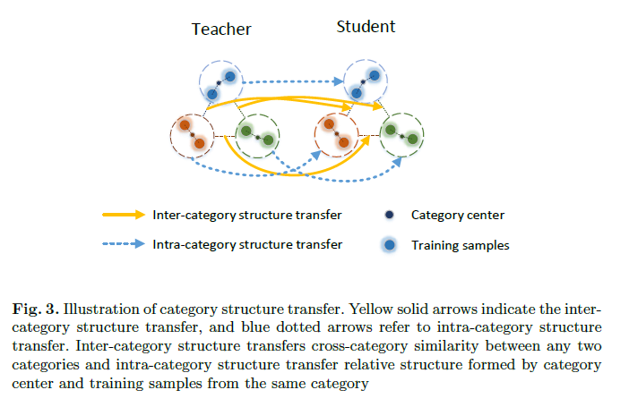
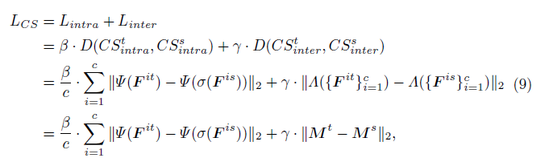
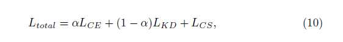
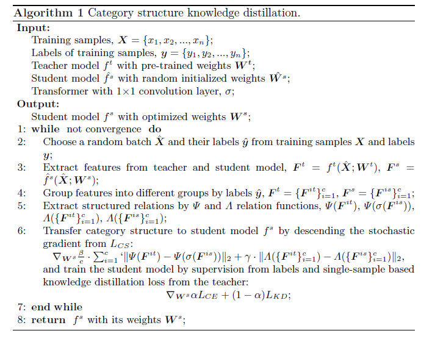

### 2020-ECCV-Improving Knowledge Distillation via Category Structure

## 摘要

之前的蒸馏方法让学生模型每个样本模仿教师模型的输出，或者模仿不同样本之间的关系，但他们忽略了类别层面的关系。

本文用类别层面的结构关系进行蒸馏。对两种结构关系进行建模，包括类内结构和类间结构。

对类别结构进行迁移提供类别层面的信息，能训练更好的学生网络

## 概述

知识蒸馏的关键问题是提取充分有效、泛化性强的知识。为了解决些问题，传统的知识蒸馏方法逐个样本处理。最近一些方法考虑多个样本间关系，但这些方法忽略了类别层面的关系。

本文提出CSKD，对类别结构关系进行迁移。

主要贡献

* 提出新的蒸馏框架CSKD，第一个引入类别层面结构关系的工作
* 定义了类内和类间结构，引入了两个有效的关系函数
* 进一步实验表明达到了SOTA

## Category Structure Knowledge Distillation

$n$为样本数，$\mathcal{H}_{cross}$为交叉熵函数，$y_i^t$和$y_i^s$为软化的softmax输出

$y_{ij}$为预测结果为第$j$类的概率，$z_j$为教师和学生的logits输出

在几个工作中，KL散度用于让教师和学生网络的分布更好地匹配

[20]中利用了多个样本间的相关性限制，计算多个样本之间的关系

$\mathbf{F^t}$和$\mathbf{F^s}$表示feature map，映射函数$\Phi:F \to \Omega\in R^{n\times n}$

直接迁移任意两对样本的二元关系十分直接，并且可能会有冗余无关信息。例如不同类的任意两个样本间都会计算二元关系，高相关性的类别会得到高相似度、低相关类别会得到低相似度。但许多这样的关系是不需要的，过多的冗余信息可能会使学生网络迷惑。因此我们考虑类别层面的结构相关信息。

### 类别结构

CS表示关系结构

$\Psi$为类内结构函数，由同一类的样本间关系构成，$\Lambda$为类间结构函数，由不同类的样本间关系构成

C为类别中心，$F_j^i$为第$i$类中的第$j$个样本，则类内结构定义为

它描述每个样本和样本中心的相对距离。假定同一类别中的样本在embedding space空间中聚集的比较紧密，则我们用同类别中心来代表一个类。基于类别中心，用余弦相似度定义类间结构关系函数，

从实验来看，两种结构关系有互相增益的作用。

### Loss for Category Structure Transfer

## 实验部分

