### 2020-ECCV-Differentiable Feature Aggregation Search for Knowledge Distillation

## 摘要

一些工作用多教师蒸馏来提供更多监督信息，但计算量很大。

作者在单教师蒸馏框架中引入feature aggregation来模仿多教师蒸馏。

DFA，一种两阶段的differentiable Feature Aggregation搜索方法，想法来自DARTS，DARTS原本是用于神经网络结构搜索，用DFA来搜索aggregations。

* 第一阶段，DFA把搜索问题公式化为一个二级优化问题，并且利用了一个bridge loss，包含学生到教师、教师到学生两条路径，来找到合适的feature aggregations。两条路径相当于两个对手，试图在相反方向上优化统一的体系结构参数，同时确保特征聚合的可表达性和可学习性。

* 第二阶段，DFA根据产生的特征聚合进行知识蒸馏。

实验表明DFA优于现有知识蒸馏方式

## 概述

为达到多教师蒸馏的效果、并使用更少的计算量，提出了DFA。在单个教师蒸馏中通过对不同层的feature进行耦合来模仿多教师模型。

主要贡献

* 引入DFA搜索方法来在单教师蒸馏框架中模仿多教师蒸馏
* 提出新的bridge loss
* 实验表明DFA比随机搜索和手动设计的搜索要好

## 方法

两阶段

AGGREGATION SEARCH

FEATURE DISTILLATION

#### Feature Distillation

DFA基于G layer group，一个layer group表示教师和学生网络中具有相同空间尺寸的层的集合。

通常和特征蒸馏设计方案分类，教师变换、学生变换、蒸馏位置、距离函数。教师变换和学生变换分别从蒸馏位置的教师和学生网络的隐藏特征中提取知识。再对提取到的知识用距离函数作为Loss。通常会用$L_2$ loss作为距离度量。$N_i^{T}$和$N_i^{S}$分别表示教师和学生网络第$i$个layer group里层的数量。蒸馏损失定义为

之前的工作，蒸馏的位置在每个layer group的结尾。并且两个映射把特征的通道数映射与教师feature map相同。

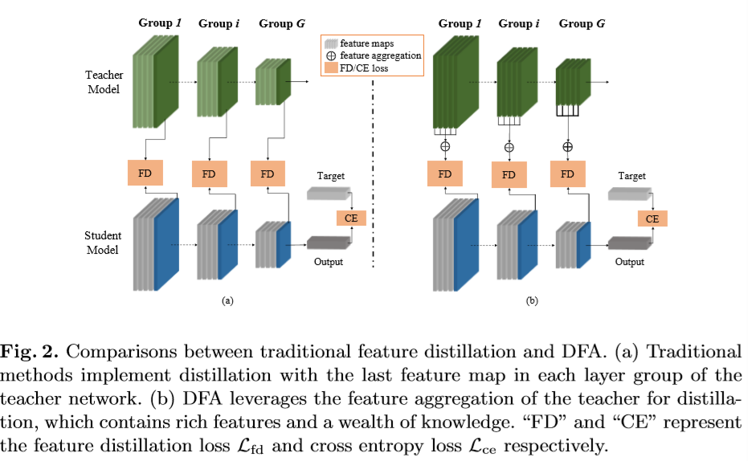

与传统蒸馏方法不同，DFA利用教师网络每个layer group的特征聚合作为学生网络的监督，如Fig2(b)。给定聚合权重，$\alpha_i=\left\{\alpha_i^1,...,\alpha_i^{N_i^T}\right\}$为教师网络中的第$i$个group，其中这一组权重相加为1，则feature aggregration可计算如下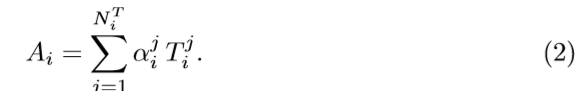

**现在有蒸馏方法可以看作特征聚合的特殊情况，当只有每个group最后一层的权重设置为1，其他层设置为0时，退化为普通蒸馏**

（1）式中的蒸馏损失

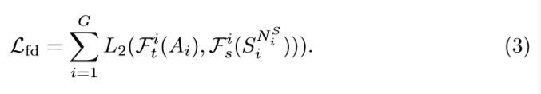

最终的损失，交叉熵和蒸馏损失trade off

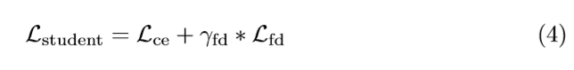

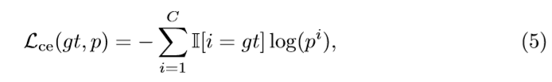

#### Differentiable Group-wise Search

由于特征聚合权重连续，搜索空间随layer groups数量指数增长，DFA用可微分结构搜索方法来搜索权重。受NAS启发，DFA逐个group进行搜索，即搜索某一组时，其他组固定。

整个框架见Fig. 3

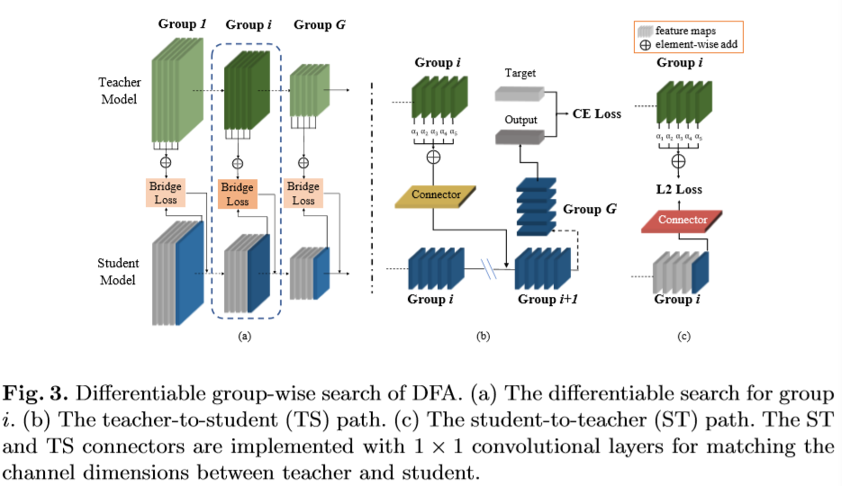

**Search Space**

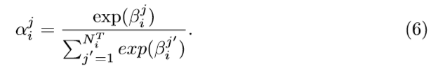

**Optimization of Differentiable Group-wise Search**

可微逐组搜索的目标是联合优化结构参数$\beta$和学生网络模型参数$w$。

$\beta^*$通过最小化验证损失$\mathcal{L}_{val}\left(w^*\left(\beta\right),\beta\right)$得到，其中对于确定的结构参数$\beta$，模型参数$w*$通过最小化训练损失函数得到$\mathcal{L}_{train}\left(w,\beta\right)$。因此联合优化问题可以看作一个两级优化问题：

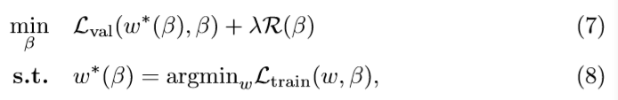

$\mathcal{R}$为对$\beta$的正则，可以轻微提高DFA的性能。

直观上看最小化训练和验证误差相当于最小化（4）中的$\mathcal{L}_{student}$，但由于交叉熵损失与结构化参数无关，因此只可以只最小化后一项。

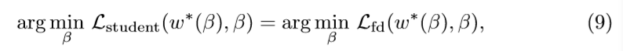

由于学生网络总是比教师网络浅，深层知识很难学习，因此除了选择具有丰富语义和较强表达能力的深层结构外，体系结构参数更喜欢与学生的深度和表现力相匹配的浅层教师。**因此，$\mathcal{L}_{student}$会偏离原来从好教师的知识蒸馏中进行学习的目标。**

此外一旦学生网络找到了匹配层，那一层权重就会比较大。由于变换函数的有偏训练，$\beta_i^j$会增长更快，对应的feature map会起主导作用。同时注意，网络在早期训练中倾向于选择浅的层，因此，学生网络不可避免的会掉点。

#### Bridge Loss for Feature Aggregation Search

为搜索更合适的聚合方式，引入bridge loss，原来学生网络中的信息流分为两条路径。

* 第一条路径如Fig3.b，DFA以第$i$个组的特征聚合$A_i$作为第$i+1$组的输入，然后用标准交叉熵损失计算$\mathcal{L}_{TS}$

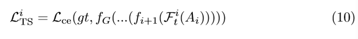

$f_i$为第$i$组中的卷积层。**与式（3）不同，$\mathcal{F}_t^i$作为TS连接器，把教师网络的feature map转化为与学生feature map通道维度相同。**

* 第二条路径ST与$\mathcal{L}_{student}$效果类似，如Fig3.c，学生网络产生$S_i^{N_i^S}$，即最后一层的feature map，然后与$A_i$对比，作为损失函数$\mathcal{L}_{ST}$

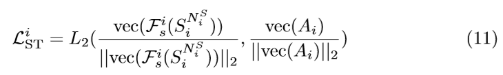

**与式（3）相同，$\mathcal{F}_s^i$作为TS连接器，把学生网络的feature map转化为与教师feature map通道维度相同，与$\mathcal{F}_t^i$相反**

bridge loss将二者聚合在一起

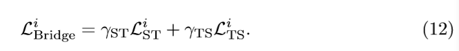

## 实验部分

