### 2020-ECCV-Feature Normalized Knowledge Distillation for Image Classfication

 

从one-hot标签的角度分析了知识蒸馏的温度机制，验证了高温度实际上是倒数第二层的L2范数的校正因子，它代表了标签噪声的密度

基于理论分析和经验发现，提出了一种简单但有效的feature normalized 蒸馏，作为对温度机制的进一步完善。

展示了KD，LSD，HE的关系

 

### One-Hot标签中的噪声

标签噪声主要有四类来源，本文关注编码噪声。

用q(k)来表示标签，但忽略了条件概率中的x

 

第一行，左和中两种鸟很相似，左中与左右相比更相似，但one-hot标签使得他们的距离相同。这种现象在ImageNet中更为显著。中下的图像可以认为是Laptop_Computer或者Screen_CRT，但它被百分之百的认为是Laptop_Computer

​    图2为例子

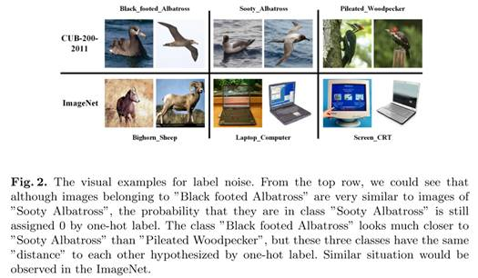

 

根据以上分析，one-hot标签假定各个类别是独立的。但实际上不同类往往有一定的视觉相似性。因些one-hot标签的强假设会带来噪声。因此引入一个补偿分布

 

​    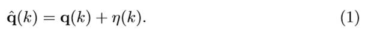

 

由以上定性分析，作者在CUB-200-2011上进行了简单实验来量化分析标签噪声对模型准确率的影响。尽管不知道标签和噪声的真实分布，但仍可以引入一些先验来估计它，例如标签平滑正则（Label Smoothing Regularization）。LSD是一种有效正则，通过将q(k)和一个均匀分布对one-hot标签进行软化

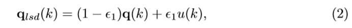

因此，LSD实际上是一种通过使用各向同性滤波来产生近近似q_hat(k)的分布的标签去噪方法。考虑到大部分图像在每个类别中表现出不同程度的视觉相似性，而不是LSD假设的均匀相似性，作者引入了一个非均匀分布，提出一种各向异性的LSD，来更好地估计q_hat(k) 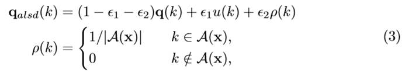

A(x)表示更接近真实类别的那些类的集合，A(x)是由数据集提供的类名决定的。

 

由于引入了类别的元信息，可以认为q_alsd(k)与q_lsd相比是q_hat(k)的更好的估计，因此会使模型有更高的准确率

 

 

 

### 标准蒸馏

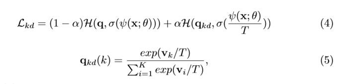

 

当T=1时

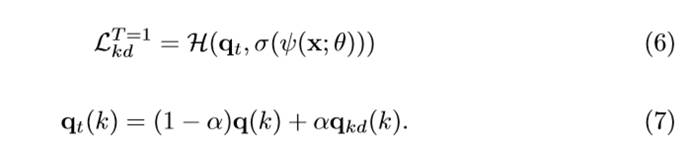

 

式（7）和式（2）是很相似的

​    这表明，$q_t(k)$和$q_{lsd}(k)$以及$q_{alsd}(k)$的作用的一样的，基于上面的讨论$\frac{\alpha}{1-\alpha}q_{kd}(k)$同样是补偿分布的一个估计，仅有的不同是$u(k)$和$\rho(k)$是预定义的，而$q_{kd}(k)$是通过另一个CNN从数据中学到的。因此从标签噪声的角度，LSD和KD都是去除one-hot标签中的噪声，得到与真实标签更接近的分布。

​    为进一步量化比较KD和LSD，分别用ResNet152和ResNet50作为老师来训练 ResNet50和ResNet18。

​    为进一步抑制噪声的影响，Hinton引入了温度参数T，T增大时，(5)中的分布更加平滑，当T远大于v_k时，可以将其泰勒展开，得到

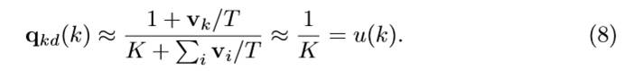

​    式（8）表明，当温度增加时，$q_{kd}(k)$逐渐变为均匀分布。之前的工作表明，中等的T往往学生网络性能较好，从标签噪声的角度在看，这是因为当T较小时，噪声更多，T较大时能过滤更多的噪声。

 

### 倒数第二层的feature

​    CNN最后一层通常是K路全连接层。

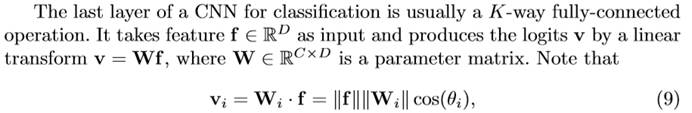

 

倒数第二层的特征L2范数越大，产生的分布越hard，对one-hot标签适配越好。但这种对one-hot的适配是不好的，可以看作是由噪声导致了f很大。因此T可以看作校正因子，减f的范数从而减小标签噪声的影响。

 由于f范数部分取决于标签噪声，因此f范数可以用来表示噪声密度。为了从经验上研究，作者在CUB-200-2011进行实验，选取了3个类，展示了f范数最大和最小的两个类。

图3中，L2范数小时，图像有相似的角度，光照，背景和看起来很相似的鸟。相对来说，L2范数大时，两张图像更有各自的特点，容易区分。

这些结果表明，尽管one-hot标签倾向于让f的L2范数更大，这些包含更多标签噪声的困难样本L2范数仍然相对较小。注意到不用样本受标签噪声影响的程度不一下，作者提出feature normalized KD，根据L2范数来抑制噪声，而不是对所有的样本用一个相同的T。

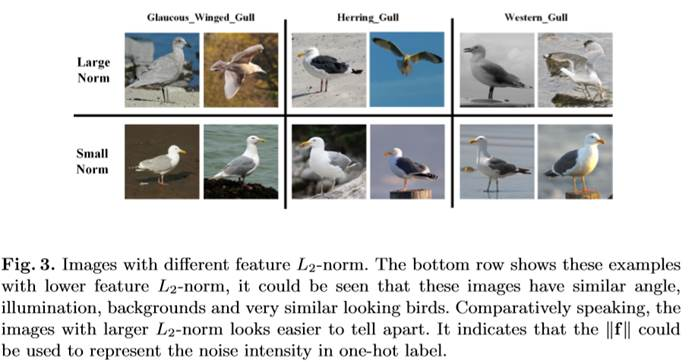

 

### Feature Normalized Knowledge Distillation

  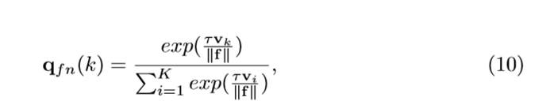

最终的损失函数

**相当于是一种自适应**

  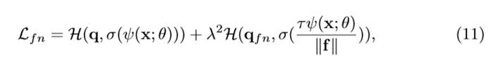

梯度

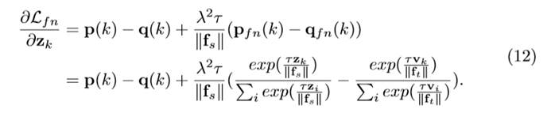

 ## 实验部分

 