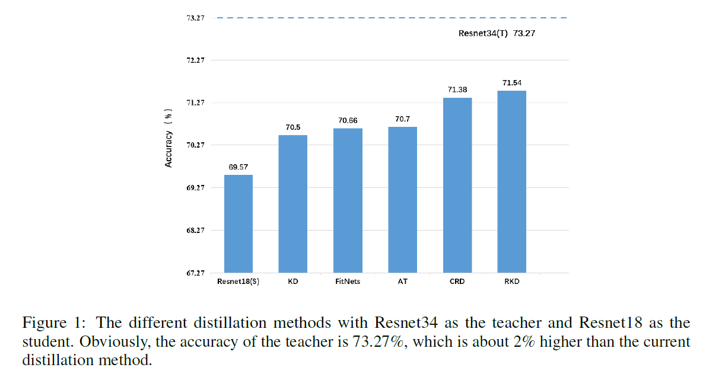
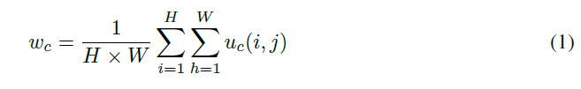
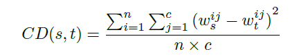
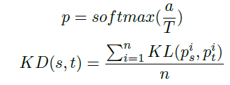
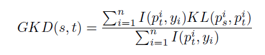
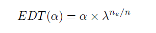
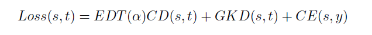
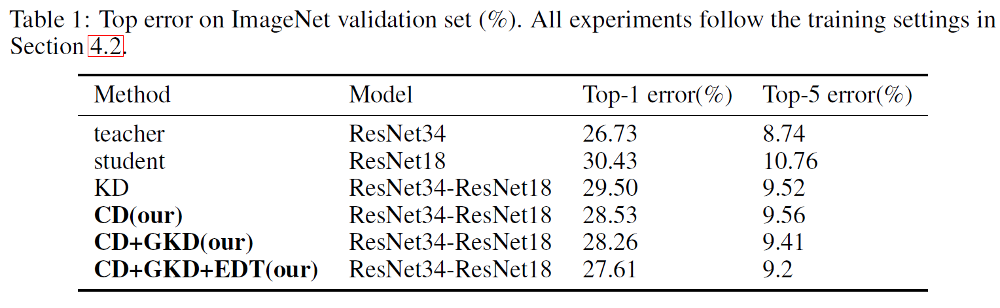
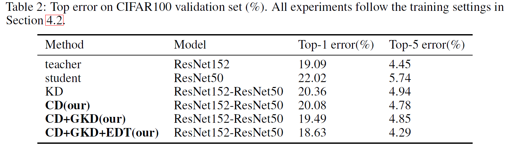
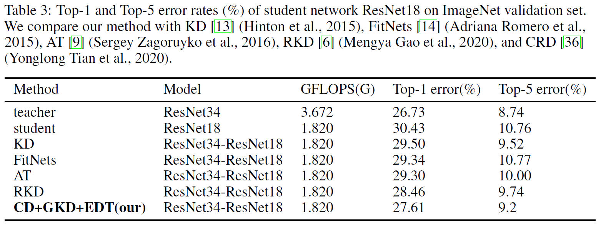

**2020-arxiv-Channel Distillation: Channel-Wise Attention for Knowledge Distillation**

# Abstract

提出两个蒸馏策略，一个基于channel-wise attention，一个是Guided Knowledge Distillation

KD让学习学习教师的每个样本的分布，GKD只让学习模仿老师正确输出

### Contributions

* 让学生学习识别通道交互的能力
* 只计算老师分类正确样本的loss
* 训练过程中对学生的监督进行decay
* 能达到SOTA

## Method

## Channel Distillation

idea来自于SENet

每个channel的权重

用每个通道的global average pooling作为来计算重要性，老师学生分别计算attention，并迁移这种信息

如果通道数不匹配，使用1x1卷积

## Guided Knowledge Distillation

传统KD

GKD

分类正确才计算loss

## Early Decay teacher

24中指出，distillation并不总有正向的效果，较早的stage，KD帮助学生学习，较晚的stage，反而会阻止学生网络学习

# 实验

